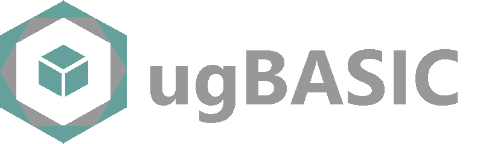

An **isomorphic BASIC** language compiler for retrocomputers by Marco Spedaletti (asimov@mclink.it)

## ABOUT THIS SOFTWARE

A cross compiler of BASIC dialect specialized in programs that are [very efficient "by design"](https://retroprogramming.iwashere.eu/midres_library:isomorphism) on various [8-bit platforms](https://retroprogramming.iwashere.eu/ugbasic:targets) (based on **[MOS 6502/6510](https://retroprogramming.iwashere.eu/ugbasic:targets#cpu_6502_based)**, **[Motorola 6809](https://retroprogramming.iwashere.eu/ugbasic:targets#based)** and **[Zilog Z80](https://retroprogramming.iwashere.eu/ugbasic:targets#z80_based)**), without the need for "fine tuning" them and without compromises of other dev-kits.

 * [Installation guide](https://retroprogramming.iwashere.eu/ugbasic:installation)
 * [Usage guide](https://retroprogramming.iwashere.eu/ugbasic:usage)
 * [Supported targets](https://retroprogramming.iwashere.eu/ugbasic:targets)

## WHY SHOULD I USE "ugBASIC"?

 * **Modern programming** - all the most modern BASIC constructs are available, like dynamic strings, procedures, constants, functions, inclusion of libraries, ....
 * **[Multitasking](https://retroprogramming.iwashere.eu/ugbasic:user:multitasking)** - procedures can be called on a parallel way.
 * **Fast execution** - BASIC source code, graphical and audio resources are compiled directly in assembly, and optimized for the specific CPU, and all calculations are done on integer numbers, moreover it does not use any stack.
 * **No ROM dependency** - the executable take care of all the hardware, with no dependency from installed ROM that will be swapped out, if possible.
 * **RAM optimizations** - all RAM is available for code and data, and it is available [a fast compression / decompression routine](https://retroprogramming.iwashere.eu/msc1) "out of the box".
 * **Cross development** - use your modern Linux or Windows PC to compile for about 20 different retro computers, from Commodore 64 to Amstrad CPC 664.
 * **[Modern IDE available](https://spotlessmind1975.itch.io/ugbasic-ide)** - you can also use a modern IDE to develop.

For more information please [look here](https://ugbasic.iwashere.eu/).

## SUPPORTED HARDWARE

This is a short list of supported hardware and output file formats:

 * Atari 400/800 (`atari`)
 * Atari 1200XL (`atarixl`)
 * Atari 600XL/800XL (`atarixl`)
 * Atari XE Video Game System (`atarixl`)
 * Commodore 128 (`c128`)
 * Commodore 64 (`c64`)
 * Commodore PLUS/4 (`plus4`)
 * Commodore VIC-20 (`vic20`)
 * Dragon 32 (`d32`)
 * Dragon 64 (`d64`)
 * Dragon 200-E (`d64`)
 * Olivetti PC128 Prodest (`pc128op`)
 * Thomson (`mo5`)
 * Amstrad CPC (`cpc`)
 * ColecoVision (`coleco`)
 * MSX (`msx1`)
 * SEGA SC-3000 (`sc3000`)
 * SEGA SG-1000 (`sg1000`)
 * ZX Spectrum 48K (`zx`)

The complete list of targets can be [found here](https://retroprogramming.iwashere.eu/ugbasic:targets).

## WHAT DOES "ug" MEAN?

It is an acronym.

 * The letter **u** stands for "micro" because it is a "minimal" language, which is translated as linearly as possible into assembly without abstractions. Note that the nature of isomorphism is like that it may not be "minimal" in terms of syntax. There may be redundancies, but the concept remains.
 * The letter **g** stands for "game", because the language was designed to write video games, even advanced ones. It has a number of primitives that hook directly to hardware characteristics. For example, there are instructions to synchronize the execution to the vertical blank, to manage animations, background music and so on.

## LICENSE

Copyright 2021-2022 Marco Spedaletti

Licensed under the Apache License, Version 2.0 (the "License");
you may not use this file except in compliance with the License.
You may obtain a copy of the License at

http://www.apache.org/licenses/LICENSE-2.0

Unless required by applicable law or agreed to in writing, software
distributed under the License is distributed on an "AS IS" BASIS,
WITHOUT WARRANTIES OR CONDITIONS OF ANY KIND, either express or implied.
See the License for the specific language governing permissions and
limitations under the License.

This program contains algorithms and software written
by [third parts](THIRD-PARTS.md). Please refer to the conditions present
in [that page](THIRD-PARTS.md) also, if you wish to reproduce or reuse this software.